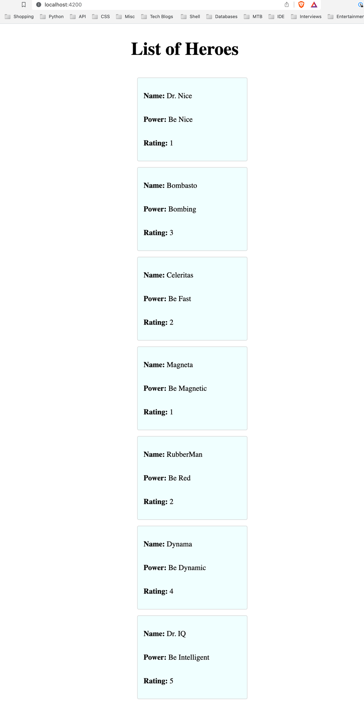

# EncoraExample

Hi Mauricio, I took the liberty of making a couple of changes to the code in this repository. Among them: 

* I refactored the word hero to hero in all component, service, and interface files. 
* I changed the name of the json file to 'hero-data' to follow Angular's convention for files and added them to the /assets folder 
for easier public access. 
* I decided to use the HttpClient module to load the file using the get method. 
* And finally I transferred the template to a separate file instead of using it inline in the typescript code and added a simple CSS.

This project was generated with [Angular CLI](https://github.com/angular/angular-cli) version 16.2.2.

## Development server

Run `ng serve` for a dev server. Navigate to `http://localhost:4200/`. The application will automatically reload if you change any of the source files.

